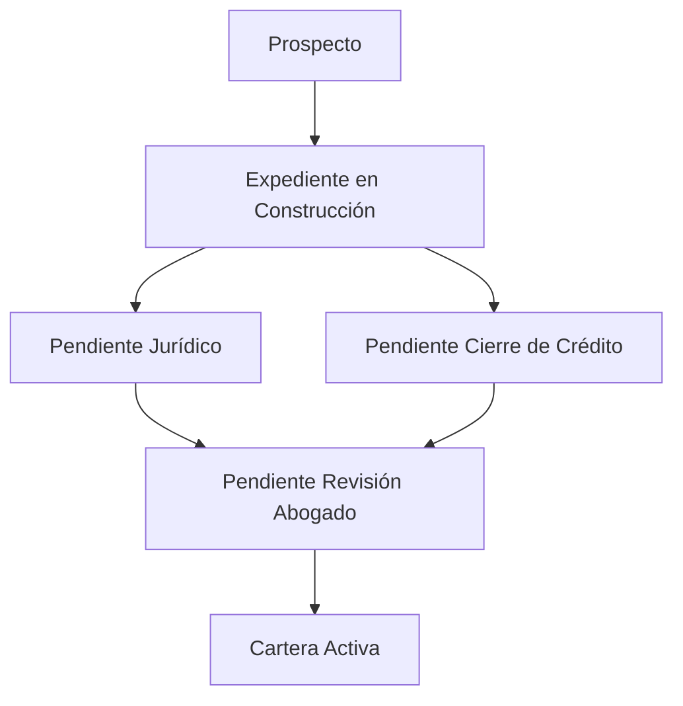

# Backend - Sistema de Gestión de Asociados

Este es el backend de un sistema para la gestión de asociados, desarrollado con Node.js, Express, TypeScript y Prisma como ORM para la base de datos SQLite.

## 🚀 Tecnologías Utilizadas

- **Node.js**: Entorno de ejecución de JavaScript del lado del servidor
- **Express**: Framework web para Node.js
- **TypeScript**: Lenguaje tipado que se compila a JavaScript
- **Prisma**: ORM moderno para Node.js y TypeScript
- **SQLite**: Base de datos relacional ligera
- **CORS**: Middleware para habilitar CORS en las peticiones

## 📋 Requisitos Previos

- Node.js (v16 o superior)
- npm (v8 o superior) o yarn
- Prisma CLI (se instala automáticamente con las dependencias)

## 🛠️ Instalación

1. Clonar el repositorio:
   ```bash
   git clone https://github.com/21harley/COAVANCOL-Prueba-T-cnica.git
   cd back-end
   ```

2. Instalar dependencias:
   ```bash
   npm install
   ```

3. Configurar variables de entorno:
   Crear un archivo `.env` en la raíz del proyecto con la siguiente configuración:
   ```
   DATABASE_URL="file:./dev.db"
   PORT=3000
   ```

4. Inicializar la base de datos:
   ```bash
   npm run setup-db
   ```

## 🔄 Flujo de Estados del Pipeline

El sistema sigue un flujo de estados específico para el seguimiento de los asociados. A continuación se detallan las transiciones permitidas:

### Diagrama de Flujo



### Transiciones Válidas
1. **Prospecto** → Expediente en Construcción
2. **Expediente en Construcción** → Pendiente Jurídico **o** Pendiente Cierre de Crédito
3. **Pendiente Jurídico** → Pendiente Revisión Abogado
4. **Pendiente Cierre de Crédito** → Pendiente Revisión Abogado
5. **Pendiente Revisión Abogado** → Cartera Activa

### Reglas de Transición
- No se pueden saltar pasos intermedios
- Algunos estados permiten múltiples caminos
- El estado final es **Cartera Activa**

## 🚀 Comandos Útiles

| Comando | Descripción |
|---------|-------------|
| `npm run dev` | Inicia el servidor en modo desarrollo con hot-reload |
| `npm run build` | Compila el código TypeScript a JavaScript |
| `npm start` | Inicia el servidor en producción |
| `npm run seed` | Ejecuta los seeders para poblar la base de datos |
| `npx prisma studio` | Abre Prisma Studio para ver y editar la base de datos |
| `npx prisma migrate dev --name nombre_migracion` | Crea y aplica una nueva migración |
| `npm run setup-db` | Ejecuta las migraciones con el nombre init y corre los seeder |
| `npm run reset-db` | Resetea la base de datos (elimina y recrea) |

## 🗄️ Estructura del Proyecto

```
back-end/
├── src/
│   ├── controllers/    # Controladores de la aplicación
│   ├── routes/         # Rutas de la API
│   ├── types/          # Tipos de TypeScript
│   ├── prisma.ts       # Configuración de Prisma
│   └── index.ts        # Punto de entrada de la aplicación
├── prisma/
│   ├── migrations/     # Migraciones de la base de datos
│   └── schema.prisma   # Esquema de la base de datos
├── .env                # Variables de entorno
└── package.json        # Dependencias y scripts
```

## 📡 Endpoints de la API

### Asociados

#### Obtener todos los asociados
- **Método:** `GET`
- **Ruta:** `/api/v1/asociados`
- **Respuesta Exitosa (200 OK):**
  ```json
  {
    "success": true,
    "data": [
      {
        "id": 1,
        "codigo": "ASOC001",
        "nombre": "Juan Pérez",
        "identificacion": "123456789",
        "estado_pipeline": "Prospecto",
        "ultima_actualizacion": "2023-12-05T03:00:00.000Z",
        "createdAt": "2023-12-05T02:30:00.000Z",
        "updatedAt": "2023-12-05T02:30:00.000Z"
      }
    ]
  }
  ```

#### Obtener un asociado por ID
- **Método:** `GET`
- **Ruta:** `/api/v1/asociados/:id`
- **Parámetros de Ruta:**
  - `id`: ID numérico del asociado
- **Respuesta Exitosa (200 OK):**
  ```json
  {
    "success": true,
    "data": {
      "id": 1,
      "codigo": "ASOC001",
      "nombre": "Juan Pérez",
      "identificacion": "123456789",
      "estado_pipeline": "Prospecto",
      "ultima_actualizacion": "2023-12-05T03:00:00.000Z",
      "createdAt": "2023-12-05T02:30:00.000Z",
      "updatedAt": "2023-12-05T02:30:00.000Z"
    }
  }
  ```
- **Error (404 Not Found):**
  ```json
  {
    "success": false,
    "message": "Asociado no encontrado"
  }
  ```

#### Crear un nuevo asociado
- **Método:** `POST`
- **Ruta:** `/api/v1/asociados`
- **Cuerpo de la Petición:**
  ```json
  {
    "codigo": "ASOC002",
    "nombre": "María López",
    "identificacion": "987654321",
    "estado_pipeline": "Prospecto"
  }
  ```
- **Respuesta Exitosa (201 Created):**
  ```json
  {
    "success": true,
    "message": "Asociado creado correctamente",
    "data": {
      "id": 2,
      "codigo": "ASOC002",
      "nombre": "María López",
      "identificacion": "987654321",
      "estado_pipeline": "Prospecto",
      "ultima_actualizacion": "2023-12-05T03:15:00.000Z",
      "createdAt": "2023-12-05T03:15:00.000Z",
      "updatedAt": "2023-12-05T03:15:00.000Z"
    }
  }
  ```
- **Error (400 Bad Request) - Estado inválido:**
  ```json
  {
    "success": false,
    "message": "Estado inválido. Estados válidos: Prospecto, En Proceso, Aprobado, Rechazado"
  }
  ```

#### Actualizar estado del pipeline
- **Método:** `POST`
- **Ruta:** `/api/v1/asociados/update-estado`
- **Cuerpo de la Petición:**
  ```json
  {
    "asociadoId": 1,
    "nuevoEstado": "En Proceso"
  }
  ```
- **Respuesta Exitosa (200 OK):**
  ```json
  {
    "success": true,
    "message": "Estado actualizado correctamente",
    "data": {
      "id": 1,
      "estado_pipeline": "En Proceso",
      "ultima_actualizacion": "2023-12-05T03:30:00.000Z"
    }
  }
  ```
- **Error (400 Bad Request) - Transición no permitida:**
  ```json
  {
    "success": false,
    "message": "Transición no permitida. De 'Prospecto' solo se puede pasar a: En Proceso, Rechazado"
  }
  ```

#### Actualizar un asociado (Parcial)
- **Método:** `PATCH`
- **Ruta:** `/api/v1/asociados/:id`
- **Parámetros de Ruta:**
  - `id`: ID numérico del asociado a actualizar
- **Cuerpo de la Petición (ejemplo):**
  ```json
  {
    "nombre": "Juan Carlos Pérez",
    "identificacion": "1234567890"
  }
  ```
- **Respuesta Exitosa (200 OK):**
  ```json
  {
    "success": true,
    "message": "Asociado actualizado exitosamente",
    "data": {
      "id": 1,
      "codigo": "ASOC001",
      "nombre": "Juan Carlos Pérez",
      "identificacion": "1234567890",
      "estado_pipeline": "Prospecto",
      "ultima_actualizacion": "2023-12-05T03:00:00.000Z",
      "createdAt": "2023-12-05T02:30:00.000Z",
      "updatedAt": "2023-12-05T03:15:00.000Z"
    }
  }
  ```
- **Error (400 Bad Request) - Sin datos para actualizar:**
  ```json
  {
    "success": false,
    "message": "No se proporcionaron datos para actualizar"
  }
  ```
- **Error (404 Not Found) - Asociado no encontrado:**
  ```json
  {
    "success": false,
    "message": "Asociado no encontrado"
  }
  ```

## 🔄 Estados del Pipeline

El sistema maneja los siguientes estados para el pipeline de asociados:

1. **Prospecto**: Estado inicial cuando se crea un nuevo asociado
2. **Expediente en Construcción**: Cuando se está armando el expediente del asociado
3. **Pendiente Jurídico**: Cuando el expediente está en revisión jurídica
4. **Pendiente Cierre de Crédito**: Cuando se espera el cierre del crédito
5. **Pendiente Firma y Litivo**: Cuando se está a la espera de firmas y documentos legales
6. **Pendiente Revisión Abogado**: Cuando el abogado debe revisar la documentación
7. **Cartera Activa**: Cuando el crédito está activo
8. **Desembolsado/Finalizado**: Cuando el proceso ha concluido exitosamente

### Transiciones Válidas

- De **Prospecto** a: Expediente en Construcción
- De **Expediente en Construcción** a: Pendiente Jurídico, Pendiente Cierre de Crédito
- De **Pendiente Jurídico** a: Expediente en Construcción, Pendiente Revisión Abogado
- De **Pendiente Cierre de Crédito** a: Pendiente Firma y Litivo
- De **Pendiente Firma y Litivo** a: Pendiente Revisión Abogado, Cartera Activa
- De **Pendiente Revisión Abogado** a: Cartera Activa, Desembolsado/Finalizado
- **Cartera Activa** a: Desembolsado/Finalizado
- **Desembolsado/Finalizado**: Estado final

## 🐛 Solución de Problemas

### Errores Comunes

1. **Error de conexión a la base de datos**
   - Verifica que el archivo `dev.db` exista en la carpeta `prisma/`
   - Ejecuta `npx prisma migrate dev --name init` para crear la base de datos

2. **Error de validación**
   - Asegúrate de que todos los campos requeridos estén presentes en las peticiones
   - Verifica que los tipos de datos sean los correctos

3. **Error de CORS**
   - Verifica que el frontend esté configurado para hacer peticiones al puerto correcto
   - Asegúrate de que el middleware CORS esté correctamente configurado

## 📄 Licencia

Este proyecto está bajo la Licencia ISC.
